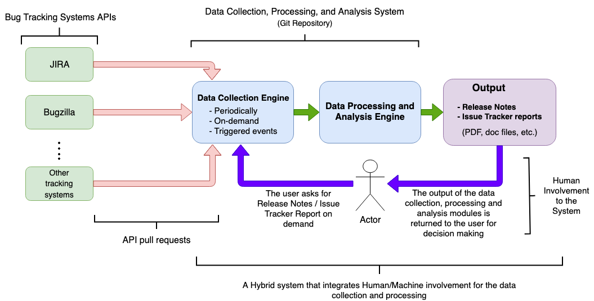
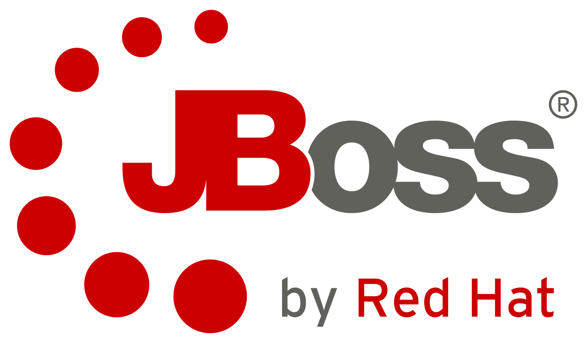

# Release Notes Generation Tool (RLGen)

The code in this repository was written for the Google Summer of Code 2019 (GSoC 2019) project for the JBoss Community
(Red Hat). The Release Notes Generation Tool (RLGen) collects and processes the data from the JIRA and Bugzilla Bug
Tracking Systems. The outcomes by this processed data are easily readable reports in AsciiDoc format.
These reports are classified into two categories:

* Release notes reports based on detected issues which are related to them, including also information for each issue.

* Issue reports including information about specified issues defined dynamically by the user, information about the
bugs assigned to a specific user, as well as information about the user.

The tool can be used to generate these reports automatically (e.g. via a cronjob) or on-demand by the actor.

Link of the proposed tool in GSoC 2019: https://summerofcode.withgoogle.com/projects/#6700180181614592

## Documentation

Please, check the *Github Wiki link* (https://github.com/tzamalisp/release-notes-generation-tool/wiki) for the detailed
documentation of the tool, the Tracking Systems you can retrieve information from, and the tool's functions.

Specifically, the following links describe in detail of how to:

* handling the tool and its basic functionalities that have been implemented successfully during the
GSoC 2019 life: https://github.com/tzamalisp/release-notes-generation-tool/wiki

* setting up the configuration files for the Authentication Step and the Fields you want to search for in each query to
the related Bug Tracking System: https://github.com/tzamalisp/release-notes-generation-tool/wiki/Configuration

* querying the JIRA API: https://github.com/tzamalisp/release-notes-generation-tool/wiki/JIRA-requester

* querying the Bugzilla API: https://github.com/tzamalisp/release-notes-generation-tool/wiki/Bugzilla-requester

## Latest Versions

### v1.0

This is the first release of the Release Notes Generation Tool (RLGen). For information about this release you can check
the following link:
* https://github.com/tzamalisp/release-notes-generation-tool/releases/tag/v1.0

## Proposal - Google Summer of Code 2019 project for the JBoss Community (Red Hat)

Below you can find the proposal I sent to JBoss Community describing the development of the proposed system, including
the methodologies, the deadlines, and the milestones of the development process.

### DESCRIPTION
The tool aims to collect, process, and analyze data from various Bug Tracking Systems. The outcomes by this processed
data are easily readable reports in various formats, like AsciiDoc, and PDF files, that contain release notes and issue
trackers based on detected bugs. The platform can generate these reports automatically, on-demand by the actor, or even
when an event is triggered and detected by the platform.

### INTRODUCTION
Nowadays, developers have some kind of superpower in their hands as technologies enabled them to many things that were
difficult for someone in the past to even imagine. Thus, incredible applications have been implemented and several
everyday issues have been solved (e.g. social networking, traffic load, etc). However, the developing of such enormous
applications usually comes with the cost of the appearance of software bugs. Software bugs are errors, flaws, failures,
or faults in  computer programs, systems or platforms that cause the outcomes of incorrect or unexpected results or the
behavior of them in unintended ways. These bugs are the reason, why the use of bug tracking systems is important in
order for these bugs to be found, documented and solved by the community of IT (Information Technology).

Several bug tracking systems have been developed over the last years which keep track and record of reported software
bugs in software development projects. A major component of a bug tracking system is a database that records facts
about known bugs. These facts (or events) may include the time a bug is reported, its severity, the erroneous program
behavior, and details on how to reproduce the bug . In addition, it contains the identity of the person who reported it
as well as any programmers who may be working on fixing it.

RLGen is an open-source tool that allows a user to request or seeing reports which are related to bugs release notes
and issues tracking. The tool connects with various bug tracking systems (like JIRA and BugZilla), and after requesting
their APIs it can scan, collect, process, and analyze the data that are relevant to bug releases notes. The requested
data can be fetched automatically, on-demand (i.e. when a user wants to engender a report), or when an event of release
is triggered. The processed data is exported into various formats (PDF, DOC, CSV) which are a manner independent of
application software, hardware, and operating systems. By the exploitation of these kinds of file formats, a naive
stakeholder can easily read them which makes the human intelligence and decision making parts more convenient and
efficient. Finally, the tool is characterized by its facile modularity that more Bug Tracking Systems can be added in
the future with minor changes to the development core.

### REQUIREMENTS & SPECIFICATIONS
A necessary process that comes with when building computational systems and IT tools is the definition of the
requirements and specifications in order to successfully developing the system. The basic programming language that
will be used to the implementation progress is Python 3.7 with Anaconda Distribution. Many libraries (software packages)
have been written until now in Python. These libraries are used in the development of various applications, as well as
libraries that allow the connection with the REST APIs of computational systems and the interaction with them. In that
particular tool development, the connection to the Bug Tracking Systems APIs and the way that the data will be obtained
is of great importance.

Two of the main Bug Tracking Systems APIs that the tool will connect, scan, and fetch the data are the JIRA and the
BugZilla. The connection with these APIs can be achieved by the corresponding Python libraries. For JIRA, the most
famous, relevant and indicative libraries are the jira and the Atlassian Python API, while for BugZilla are the
bugzilla and the python-bugzilla. The most of these libraries require the python-requests library (or similar libraries)
which handles the HTTP occupation.

The majority of Python’s libraries can be installed with pip which is a package-management system used in the terminal
to install and manage software packages written in Python. Many packages can be found in the default source for
packages and their dependencies (Python Package Index). Other Python libraries that have a high probability of usage in
the proposed tool are the json and csv for handling the corresponding JSON and CSV data formats, as well as libraries
that manipulate the creation of PDF or DOC output files of the system that contain the bugs’ release notes.

Finally, a Git repository is created for the needs of the project, for better handling of implementation progress
versions, solving possible introduced issues, and helping project’s Google Mentors to have holistic supervision of the
development procedure.

### SYSTEM DESIGN
As shown in the generic system architecture in the Figure below, the overall process of building a bug release notes
tool is devided into components, each one with different functionalities. In that way, the tool is flexible enough to
the user (actor/actuator) to generate reports in a stable and more automated way.

The above Figure presents the components of the tool and the data flow can be summarized in the following parts:

1) **The user** asks the tool for a Bugs Release Notes / Issues Tracking report via a python script in command prompt.
The script has as inputs some arguments like the bug release note ID, the file she wants the results to be exported, as
well as other inputs that will be discussed with the Mentors. There are three ways in which the user can obtain
the data:
    - *On-demand​:* The user asks for a new report randomly, i.e. whenever she wants to.
    - *Periodically:* New reports are generated automatically in specific time intervals.
    - *Triggered events:* New report is generated when a specific new amount of bugs is detected, i.e. a trend is
    scanned.

2) **The Data Collection Engine** sends pull requests to each Bug Tracking System’s API to obtain the relevant data that
come with specific data structures (maybe different for each API). At the starting point, an Open Authorization (OAuth)
request to each API is created to retrieve the relevant access keys and tokens so the access to the data is granted.
After obtaining the access delegation by each Tracking System API as dictated by its OAuth policies and protocols, it
does pull requests to them in order to retrieve the data. Each data bunch that is obtained by the corresponding API has
its inherent data structure.

3) **The Data Processing and Analysis Engine** component do all the procedures that are related to data cleaning,
processing, and transformation to the suitable form. More specifically, in the processing part, different functions
clean the raw and “misunderstood” data (e.g. null values, errors, and undesirable data), and they transform cleaned one
to the covetable data structure for later use by the component of data exports.

4) Result presentation (**Output**): This component is responsible for the generation of the requested by the user file
formats that the reports should be exported. The reports can be in AsciiDoc, PDF, DOC, or CSV file formats.

In fact, *RLGen* adopts a kind of *hybridization* on the way the reports are generated. From the perspective of *Human
Intelligence*, this belongs to the on-demand scanning of the Bug Tracking Systems, while Machine Intelligence is about
the *automated* or *event-triggered scanning*. Nevertheless, after the report generation, the decision making pertains
to the human part.

### DELIVERABLES & MILESTONES

This section includes the development planning of the tool. Several milestones and deliverables have been defined due
to Google’s “Summer of Code” call and with the Mentors. On *May 27* is the starting period of tool development. The
next steps are devided into the next subsections.

#### 01) June 24 2019 - Implementation Phase Pt. 1

After the determination of the tool’s requirements and specifications, the implementation period starts. *Phase 1*
includes the following milestones:

- *03 June 2019* → Definition of the Bug Tracking Systems APIs that will be used and Git repository initiation.

- *14 June 2019* → Selection of the suitable Python libraries that will be used to connect with the APIs, their
dependencies, and finally, getting the corresponding access delegation credentials.

- *24 June 2019* → Successfully fetching the data from Bug Tracking Systems APIs using relevant libraries.

#### 02) July 22 2019 - Implementation Phase Pt. 2

This is the period of building the main core of the tool where the data pre-processing, processing and analysis take
place. It includes only one milestone that is equal with the predefined by Google deadline:

- *22 July 2019* → This implementation step is about the cleaning, the process and the analysis of the data that is
fetched to the system. The User Experience (UX) is also part of that phase, as the arguments that will define and feed
the data inputs of the platform, as well as the related analysis and exports will be built. Other parameters will be
determined to be part of that inputs, for example, the DateTime the user asked for the generation of the report, etc.
The final part of that period is the transformation of the data to a suitable structure for further processing by the
output creation component.

#### 03) August 26 2019 - Implementation Phase Pt. 3, Performance Improvements and Final Evaluation

The final phase comprises three milestones, which are related to the data exports in easily readable formats,
performance improvements, and final debugging:

- *28 July 2019* → Selection and determination of the reports file formats that will be exported by the system and the
relevant Python libraries that will manipulate this process.

- *18 August 2019* → The final form of the reports will be successfully exported to suitable formats, and performance
improvements will take place until that deadline.

- *24 August 2019* → This is the last step of evaluation where a minor debugging will take place in case errors will be
found, and after this, the tool will be submitted.

#### Google Summer Of Code 2019 in collaboration with:

 
